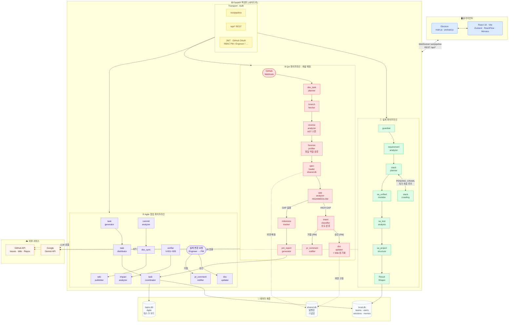

<div align="center">

# 🧭 NAVIGATOR

### AI 기반 PM · Agile · 코드 QA 코-파일럿

**설계하고, 개발하고, 검증하라 — 하나의 AI 네이티브 워크플로우로.**

[](./backend/version.py)
[](https://python.org)
[](https://fastapi.tiangolo.com)
[](https://react.dev)
[](https://electronjs.org)
[](https://langchain-ai.github.io/langgraph)
[](./LICENSE)

<br/>

> NAVIGATOR는 **세 개의 핵심 파이프라인**으로 구성된 AI 데스크톱 에이전트입니다.
>
> **① 설계** — 아이디어나 코드베이스를 완전한 PM + SA 문서로 몇 분 만에 변환  
> **② Agile 협업** — 태스크를 자동 생성·배분하고, GitHub와 연결하며, 설계 변경 승인 워크플로우 제공  
> **③ QA** *(개발 예정)* — PR마다 실제 코드를 역분석해 설계 명세와 비교하고, GAP을 의도적·비의도적으로 분류해 PM에게 결재 요청

<br/>

[**빠른 시작**](#-빠른-시작) · [**아키텍처**](#-아키텍처) · [**설계 파이프라인**](#-설계-파이프라인) · [**Agile 협업**](#-agile-협업-파이프라인) · [**QA 파이프라인**](#-qa-파이프라인-개발-예정) · [**API 레퍼런스**](#-api-레퍼런스) · [**기여하기**](#-기여하기)

<br/>

[English](./README.md) | **한국어**

</div>

---

## ✨ 세 가지 핵심 기둥

<table>
<tr>
<td width="33%">

### 🏗️ 설계 (Design)
단 하나의 아이디어나 기존 코드베이스로부터 완전한 소프트웨어 아키텍처 패키지를 생성합니다.

- 요구사항 추적 매트릭스 (RTM)
- 컴포넌트 아키텍처 + 의존성 그래프
- REST API 명세 (OpenAPI 스타일)
- DB 스키마 (DBML)
- 테스트 전략 및 테스트 케이스
- 프로젝트 디렉토리 구조

세 가지 모드: `CREATE` · `UPDATE` · `REVERSE_ENGINEER`

</td>
<td width="33%">

### 🏃 Agile 협업
설계 문서와 실제 개발 사이의 간극을 메웁니다.

- SA 산출물에서 태스크 티켓 자동 생성
- 역할(role) + 업무량(workload) 기반 팀원 자동 배분
- 설계 변경 요청에 대한 PM 승인 워크플로우
- GitHub Issues / Wiki 직접 발행
- 태스크 상태 관리: `미할당` → `승인` → `완료`

</td>
<td width="33%">

### 🔬 QA *(개발 예정)*
모든 PR에서 설계 적합성을 자동 검사합니다.

- 브랜치 코드 AST 스캔 → `code_inventory` 빌드
- `shared.db`에서 발행된 설계 명세 로드
- GAP 식별: 누락 API, 누락 컴포넌트, 설계 불일치
- 각 GAP을 **의도적(INTENTIONAL)** / **비의도적(UNINTENTIONAL)** 으로 분류
- PM에게 결재 요청하거나 PR에 자동 코멘트 게시

</td>
</tr>
</table>

---

## 🗺️ 아키텍처



---

## 🔬 설계 파이프라인

### 세 가지 분석 모드

| 모드 | 입력 | 출력 |
|------|------|------|
| `CREATE` | 제품 아이디어 (텍스트) | RTM · 기술 스택 · 컴포넌트 아키텍처 · API 명세 · DB 스키마 · 테스트 전략 · 디렉토리 구조 |
| `UPDATE` | 이전 분석 JSON + 새 기능 설명 | 기존 기능 ID/위치를 보존하면서 병합된 설계 |
| `REVERSE_ENGINEER` | 기존 코드베이스 경로 | AST 기반 RTM · 컴포넌트 맵 · API 표면 재구성 |

### 자가 치유 에이전트 루프

Stack Planner가 불완전한 기술 스택 데이터를 감지하면 자동으로 `PENDING_CRAWL`을 큐에 넣고 크롤링 루프에 재진입합니다 (최대 2회). 사람이 개입할 필요가 없습니다.

### 실시간 스트리밍

모든 파이프라인 노드가 WebSocket을 통해 상태와 추론 과정을 UI에 스트리밍합니다:

```json
{ "type": "status",   "node": "requirement_analyzer", "data": { "status": "running" } }
{ "type": "thinking", "node": "stack_planner",         "data": { "text": "React vs Vue 비교 분석 중..." } }
{ "type": "result",   "node": "complete",              "data": { /* 전체 산출물 페이로드 */ } }
```

### 출력 산출물

| 키 | 내용 |
|----|------|
| `requirements_rtm` | 우선순위·카테고리·추적성이 포함된 원자적 요구사항 |
| `context_spec` | 프로젝트 컨텍스트 요약 |
| `sa_arch_bundle` | 컴포넌트 아키텍처 및 의존성 그래프 |
| `sa_api` | OpenAPI 스타일 엔드포인트 명세 |
| `sa_db` | DBML 데이터베이스 스키마 |
| `sa_test_analysis_output` | 단위/통합/E2E 테스트 전략 및 테스트 케이스 |
| `sa_project_structure` | 권장 디렉토리 레이아웃 |
| `pm_overview` · `sa_overview` | QA 요약 리포트 |

---

## 🏃 Agile 협업 파이프라인

### 태스크 자동 생성 및 배분

완성된 SA 산출물을 읽어 구현 티켓으로 자동 분해합니다:

| SA 산출물 | 생성되는 태스크 유형 |
|-----------|---------------------|
| `sa_arch_bundle.components` | 컴포넌트 구현 (프론트엔드 / 백엔드) |
| `sa_arch_bundle.apis` | API 엔드포인트 구현 |
| `sa_arch_bundle.tables` | DB 테이블 구현 |
| `sa_project_structure` | 초기 프로젝트 스캐폴드 설정 |
| `sa_test_analysis_output.risk_zones` | 테스트 구현 |
| `pm_bundle` (RTM) | 태스크 제목 / 설명 구체화 |

**역할 + 업무량** 기반으로 팀원에게 자동 배분합니다:

| 역할 | 배분 규칙 |
|------|----------|
| PM | 배분 대상 제외 (검토 및 승인자) |
| Engineer | 풀스택 — 모든 유형의 태스크 수신 |
| Backend / Frontend / DevOps | 각 도메인에 맞는 태스크만 수신 |

### 태스크 라이프사이클

```
미할당 → PR 대기중 → 승인 → 완료 (히스토리)
                 └→ 거절 → 미할당 (재배분)
```

- **PR 대기중**: 해당 브랜치에 PR이 오픈될 때 자동 전환
- **승인**: PM이 구현을 최종 확인
- **거절**: 미할당 큐로 반환되어 재배분

### 설계 변경 요청 흐름

```
Engineer                PM                    시스템
   │                     │                       │
   ├─ POST /api/change-requests ──────────────► │
   │   (대상 섹션 + 변경 설명)                    │
   │                     │                       │
   │            PATCH /api/change-requests/{id}  │
   │                  승인 ──────────────► doc_updater
   │                  거절 ───────────────► pr_comment_notifier
```

### GitHub 연동

- 설계 문서를 **GitHub Issues**에 발행
- 아키텍처 리포트를 **GitHub Wiki**에 동기화 (`doc_sync`)
- `commit_analyzer`로 커밋 이력 분석
- 설계 GAP 요약을 PR에 직접 코멘트 (`pr_comment_notifier`)

---

## 🔬 QA 파이프라인 *(개발 예정)*

> QA 파이프라인은 설계와 구현 사이의 간극을 자동으로 닫습니다. GitHub PR/push 이벤트에 자동 트리거되며 PM이 바로 결재할 수 있는 적합성 리포트를 생성합니다.

### 파이프라인 흐름

```
GitHub Webhook (PR 오픈 / 피처 브랜치 push)
       │
       ▼
dev_task_planner   — 웹훅 페이로드 파싱 (브랜치명, PR#, commit SHA, 브랜치 생성 시점)
       │
branch_fetcher     — repo_cache.get_local_repo_path() → git checkout 대상 브랜치
       │
reverse_analyzer   — 단일 AST 스캔 → (project_context str, code_inventory dict) 동시 생성
       │              [pipeline_runner.build_reverse_context() 래핑]
       │
forensic_profiler  — 각 파일의 역할 분류: DB · API · SERVICE · UI · STORE · CONFIG · UTIL
       │              출력: file_role_map {file_path: role}
       │
spec_loader        — 브랜치 생성 시점 기준으로 shared.db에서 발행된 설계 명세 로드
       │              더 최신 버전이 존재하면 spec_outdated: true 설정
       │              출력: spec {components, apis, tables} + spec_version + spec_outdated
       │
gap_analyzer       — spec vs file_role_map 비교
       │              → 누락 API, 누락 컴포넌트, 설계 의도 불일치
       │              → 중요도: HIGH · MED · LOW
       │              → spec_outdated이면 버전 차이로 인한 GAP임을 표기
       │
       ├─── HIGH GAP 발견 ──►
       │         intent_classifier  — INTENTIONAL / UNINTENTIONAL 분류
       │              (근거: 커밋 메시지 + PR 설명 vs 설계 의도)
       │              (spec_outdated GAP은 INTENTIONAL 후보로 우선 분류)
       │                    │
       │         ┌──────────┴──────────┐
       │      승인 (PM)            거절 (PM)
       │   [TaskApprovalPanel]  [TaskApprovalPanel]
       │           │                    │
       │      doc_updater         pr_comment_notifier
       │      (승인된 GAP을        ("설계 의도와 불일치,
       │       설계 문서 반영        재검토 필요" 코멘트)
       │       + GitHub Wiki 동기화
       │       + SQLite 기준 버전을
       │       해당 브랜치 시점으로 고정)
       │
       └─── GAP 없음 ──►
                 milestone_tracker     — 피처 완료율 + 예상 완료일 계산
                      │
                 pm_report_generator   — PM 전용 통합 리포트:
                      │                   · 마일스톤 달성률
                      │                   · GAP 목록 (중요도순)
                      │                   · 의도 분류 결과
                      │                   · spec_outdated 경고 ("개발자가 v1 기준 개발 중, v2 존재")
                      │
                 task_coordinator      — local.db 업데이트 · Agile 보드에 태스크 큐 적재
                      │
                 develop_embedding     — GAP 분석 결과 + PM 리포트를 local.db에 영속화
```

### 노드 레퍼런스

| 노드 | 상태 | 기반 코드 |
|------|------|----------|
| `dev_task_planner` | 수정 | 기존 노드 — RTM 읽기를 웹훅 페이로드 파싱으로 교체 |
| `branch_fetcher` | 신규 | `repo_cache.get_local_repo_path()` + git checkout |
| `reverse_analyzer` | 신규 | `build_reverse_context()` 래핑 — 단일 스캔, 이중 출력 |
| `forensic_profiler` | 신규 | `code_inventory` → LLM 역할 분류 |
| `spec_loader` | 신규 | `publish_service.py` + shared.db 조회 패턴 |
| `gap_analyzer` | 신규 | LLM 노드 — 명세 vs 구현 diff |
| `intent_classifier` | 신규 | LLM 노드 — 커밋 메시지 + PR 설명 근거 |
| `milestone_tracker` | 수정 | `feature_queue_controller` 교체 |
| `pm_report_generator` | 신규 | `feature_completion_qa_report()` 구조 참고 |
| `pr_comment_notifier` | 수정 | `branch_pr_orchestrator` 교체 — PR 코멘트만, PR 생성 제거 |
| `doc_updater` | 신규 | `doc_sync` 확장 — PM 승인 GAP을 설계 + Wiki에 반영 |
| `task_coordinator` | 수정 | 기존 Agile 노드 — QA 결과 영속화 추가 |
| `develop_embedding` | 수정 | 기존 dev-pipeline — GAP 분석 + PM 리포트 대상으로 변경 |

---

## 🚀 빠른 시작

### 사전 요구사항

| 항목 | 버전 |
|------|------|
| Node.js | 18 이상 |
| Python | 3.11 이상 |
| Google Gemini API 키 | [발급하기 →](https://aistudio.google.com/app/apikey) |

### 1. 클론 및 설치

```bash
git clone https://github.com/your-org/navigator.git
cd navigator

# Node 의존성 설치
npm install

# Python 가상환경 생성 및 백엔드 의존성 설치
cd backend
python -m venv .venv

# Windows
.venv\Scripts\activate
# macOS / Linux
# source .venv/bin/activate

pip install -r requirements.txt
cd ..
```

### 2. 환경변수 설정

```bash
# Windows
copy backend\.env.example backend\.env

# macOS / Linux
cp backend/.env.example backend/.env
```

`backend/.env` 편집:

```env
GEMINI_API_KEY=여기에_Gemini_API_키_입력
ENV=dev

# 선택사항: 팀 협업 + QA 파이프라인 기능용 GitHub OAuth
GITHUB_CLIENT_ID=your_github_client_id
GITHUB_CLIENT_SECRET=your_github_client_secret
```

### 3. 실행

```bash
# Windows — 원클릭 실행 (권장)
run_v2.bat

# 크로스 플랫폼
npm run dev
```

런처 실행 순서:
1. 기존 node / python / electron 프로세스 정리
2. Vite 개발 서버 시작 및 포트 5173 대기
3. Electron 앱 실행 (FastAPI 사이드카 자동 기동)

---

## 🔌 API 레퍼런스

### WebSocket — `/ws/pipeline`

```json
{
  "type": "analyze",
  "payload": {
    "action_type": "CREATE",
    "idea": "여기에 제품 아이디어를 입력하세요",
    "api_key": "GEMINI_API_KEY",
    "auth_token": "JWT_TOKEN"
  }
}
```

### REST 엔드포인트

| 메서드 | 엔드포인트 | 설명 | 인증 |
|--------|----------|------|------|
| `GET` | `/health` | 헬스 체크 | — |
| `POST` | `/auth/register` | 계정 생성 | — |
| `POST` | `/auth/login` | 이메일/비밀번호 로그인 | — |
| `GET` | `/auth/github/oauth-url` | GitHub OAuth 웹 플로우 | — |
| `POST` | `/auth/github/device-start` | GitHub Device Flow 시작 | — |
| `POST` | `/auth/github/device-poll` | GitHub Device Flow 폴링 | — |
| `GET` | `/auth/me` | 현재 사용자 프로필 | ✓ |
| `POST` | `/api/analyze` | 동기 파이프라인 실행 | ✓ |
| `POST` | `/api/idea-chat` | 멀티턴 아이디어 채팅 | ✓ |
| `POST` | `/api/agile/verify` | 설계 일관성 검증 (V-001~V-009) | ✓ |
| `POST` | `/api/agile/impact` | 변경 영향 분석 | ✓ |
| `POST` | `/api/agile/generate-tasks` | SA 산출물 기반 태스크 자동 생성 | ✓ |
| `POST` | `/api/agile/distribute-tasks` | 태스크를 팀원에게 배분 | ✓ PM |
| `GET/PATCH` | `/api/change-requests` | 설계 변경 요청 관리 | ✓ |
| `POST` | `/api/github/publish` | 설계 문서를 GitHub Issues에 발행 | ✓ |
| `POST` | `/api/doc-sync` | 리포트를 GitHub Wiki에 동기화 | ✓ |
| `GET/POST` | `/api/tasks` | 태스크 CRUD | ✓ |
| `GET/POST` | `/api/snapshots` | 분석 스냅샷 발행/복원 | ✓ |
| `GET/POST/DELETE` | `/api/memos` | 세션 메모 관리 | ✓ |
| `GET` | `/metrics` | Prometheus 메트릭 | — |

---

## 🗄️ 데이터베이스 스키마

| 데이터베이스 | 내용 |
|-------------|------|
| `local.db` | teams · users · analysis_sessions · analysis_results · memo_items · design_change_requests |
| `shared.db` | published_snapshots (팀 간 공유, QA `spec_loader`의 버전 매칭에 사용) |
| `tasks.db` | tasks (Agile 보드: 유형 · 상태 · 담당자 · payload) |

---

## 🏗️ 프로젝트 구조

```
navigator/
├── electron/
│   ├── main.js               # Electron 메인 프로세스, FastAPI 사이드카 기동
│   └── preload.js            # IPC 브리지
├── src/
│   ├── components/
│   │   ├── ResultViewer.jsx
│   │   ├── resultViewer/
│   │   │   ├── RTMTab.jsx · SAComponentsTab.jsx · SAApiTab.jsx
│   │   │   ├── SADatabaseTab.jsx · SATestStrategyTab.jsx
│   │   │   ├── ProjectStructureTab.jsx
│   │   │   ├── AgileVerifierTab.jsx   # V-001~V-009 검증 결과
│   │   │   ├── AgileImpactTab.jsx     # 변경 영향 분석
│   │   │   └── TaskApprovalPanel.jsx  # PM 결재 UI (Agile + QA 공용)
│   │   └── github/GitHubDashboard.jsx
│   └── store/slices/
│       ├── authSlice.js · pipelineSlice.js · wsSlice.js
│       ├── sessionSlice.js · githubSlice.js · publishSlice.js
│       └── uiSlice.js · fileSlice.js · notificationSlice.js
├── backend/
│   ├── auth/                 # JWT + GitHub OAuth + RBAC
│   ├── transport/            # rest_handler.py · ws_handler.py
│   ├── orchestration/        # pipeline_runner.py · graph.py · aux_graphs.py
│   ├── pipeline/domain/
│   │   ├── pm/nodes/         # guardian · requirement_analyzer · stack_planner
│   │   ├── sa/nodes/         # sa_unified_modeler · sa_test_analysis · sa_project_structure
│   │   ├── agile/nodes/      # verifier · impact · task_generator · task_distributor · doc_sync
│   │   └── chat/             # idea_chat
│   ├── result_shaping/       # result_shaper.py · sa_artifact_compiler.py
│   ├── connectors/           # github_connector.py · folder_connector.py · repo_cache.py
│   ├── storage/              # publish_service.py
│   └── observability/        # logger.py · metrics.py
├── run_v2.bat
└── package.json
```

---

## 🧩 파이프라인 확장하기

### 새로운 노드 추가

```python
# backend/pipeline/domain/<domain>/nodes/your_node.py
from pipeline.core.state import PipelineState

async def your_node(state: PipelineState) -> dict:
    data = state.get("some_key", [])
    result = await your_llm_call(data)
    return {"your_output_key": result}
```

`graph.py`에서 비용 추적 데코레이터 적용:

```python
from orchestration.pipeline_runner import _wrap_node_with_usage
graph.add_node("your_node", _wrap_node_with_usage("your_node", your_node))
```

보호된 엔드포인트에는 적절한 의존성을 사용합니다:

```python
# 인증된 모든 사용자
async def endpoint(user = Depends(get_current_user)): ...

# PM 역할만
async def endpoint(user = Depends(require_pm)): ...
```

---

## ⚙️ 설정

| 변수 | 필수 | 설명 |
|------|------|------|
| `GEMINI_API_KEY` | ✅ | Google Gemini API 키 |
| `ENV` | — | `dev` / `prod` (기본값: `dev`) |
| `GITHUB_CLIENT_ID` | — | GitHub OAuth 앱 클라이언트 ID |
| `GITHUB_CLIENT_SECRET` | — | GitHub OAuth 앱 클라이언트 시크릿 |

| npm 스크립트 | 설명 |
|-------------|------|
| `npm run dev` | 전체 스택 (Vite + Electron) |
| `npm run backend` | 백엔드만 실행 (포트 8765) |
| `npm run build:electron` | Electron 앱 패키징 |

---

## 🧪 테스트

```bash
cd backend
python -m pytest -q test/
```

주요 변경 후 스모크 테스트 체크리스트:

- [ ] `CREATE` 모드 — 아이디어 입력 → 전체 산출물 생성 확인
- [ ] `UPDATE` 모드 — 이전 결과 로드 → 기능 추가 후 기존 설계 보존 확인
- [ ] `REVERSE_ENGINEER` 모드 — 로컬 폴더 선택 → 역공학 결과 확인
- [ ] WebSocket 스트리밍 — 실시간 진행 상황 표시 확인

---

## 🔒 보안

- **`.env`는 절대 커밋하지 마세요** — `.env.example`만 버전 관리
- CORS는 `localhost` / `127.0.0.1` 출처로만 제한
- RBAC는 의존성 계층에서 강제 (`require_pm`, `require_engineer`)

```bash
# 푸시 전 시크릿 유출 패턴 확인
git diff --cached | grep -E "(sk-|ghp_|AIza|PRIVATE KEY)"
```

---

## 🛠️ 트러블슈팅

<details>
<summary><strong>시작 시 WebSocket 연결 실패</strong></summary>

Electron 콘솔에서 `[Python] Initializing PM Agent Backend subsystems...` 메시지를 확인하세요.  
`run_v2.bat`으로 재시작해 기존 프로세스를 정리합니다.

</details>

<details>
<summary><strong>포트 5173 대기 시간 초과</strong></summary>

`vite.log` 마지막 40줄에서 오류를 확인하세요. 다른 프로세스가 포트 5173을 점유하고 있는지 확인합니다.

</details>

<details>
<summary><strong>아키텍처 다이어그램에 컴포넌트가 0개로 표시됨</strong></summary>

`sa_phase1.file_inventory`가 비어 있거나 `mapped_requirements[].file_path`가 누락된 경우입니다. 분석을 재실행하세요 — 기존 JSON은 소급 적용되지 않습니다.

</details>

<details>
<summary><strong>GitHub OAuth Device Flow가 멈춤</strong></summary>

1. `POST /auth/github/device-start` → 응답의 `verification_uri`를 브라우저에서 열고 `user_code` 입력
2. `status: "authorized"`가 될 때까지 5초 간격으로 `POST /auth/github/device-poll` 폴링
3. `.env`에 `GITHUB_CLIENT_ID`가 설정되어 있는지 확인

</details>

---

## 🗺️ 로드맵

- [ ] QA 파이프라인 — GitHub Webhook 연동 (설계 → 구현 적합성 검사)
- [ ] QA 파이프라인 — `code_inventory` + `file_role_map` 기반 테스트 코드 자동 생성 및 실행
- [ ] 멀티 모델 지원: OpenAI / Anthropic Claude
- [ ] MCP (Model Context Protocol) 서버 모드
- [ ] Confluence / Notion 내보내기
- [ ] 실시간 공동 편집 (멀티 유저 세션)
- [ ] VS Code 익스텐션
- [ ] Docker Compose 원커맨드 실행 환경

---

## 🤝 기여하기

1. 저장소를 포크합니다
2. 기능 브랜치를 생성합니다: `git checkout -b feat/your-feature`
3. 새 파이프라인 노드: `pipeline/domain/<domain>/nodes/`에 배치, `_wrap_node_with_usage` 적용
4. `backend/test/`에 테스트를 작성합니다
5. 세 가지 모드(CREATE / UPDATE / REVERSE_ENGINEER) 수동 스모크 테스트를 진행합니다
6. 변경 내용과 동기가 명확한 PR을 오픈합니다

### 코드 스타일

- **백엔드**: PEP 8, 전체 타입 힌트, 모든 스키마에 Pydantic v2 모델
- **프론트엔드**: 함수형 컴포넌트, 공유 상태는 Zustand, 스타일링은 Tailwind
- **보호된 엔드포인트**: `Depends(get_current_user)` 또는 역할별 의존성 필수

---

## 📄 라이선스

MIT 라이선스 — 자세한 내용은 [LICENSE](./LICENSE) 파일을 참조하세요.

---

<div align="center">

[LangGraph](https://langchain-ai.github.io/langgraph) · [FastAPI](https://fastapi.tiangolo.com) · [Electron](https://electronjs.org) · [React](https://react.dev) · [Google Gemini](https://ai.google.dev) 로 만들어졌습니다

**NAVIGATOR가 설계·개발·QA 시간을 줄여줬다면, ⭐ 을 눌러주세요**

</div>
