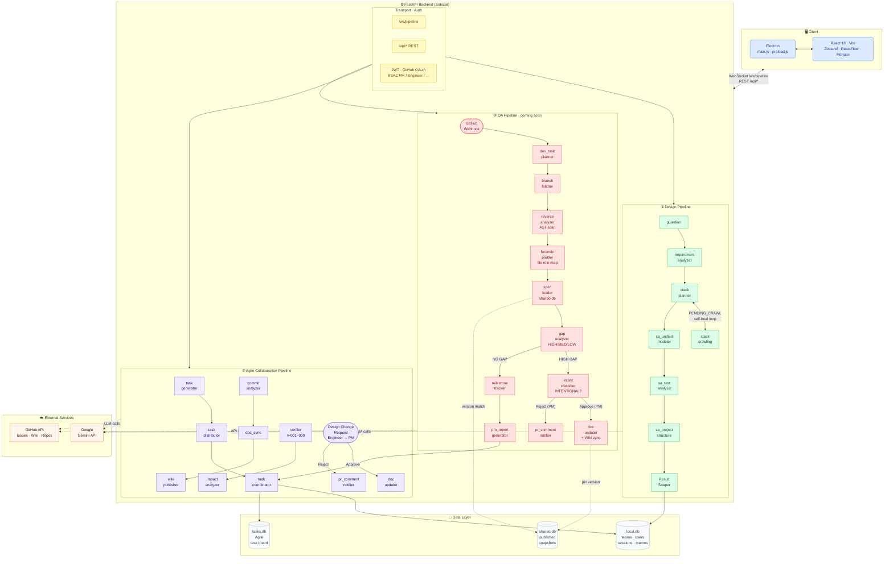

<div align="center">

# 🧭 NAVIGATOR

### AI-Powered PM · Agile · Code QA Co-Pilot

**Design. Ship. Verify. — All in one AI-native workflow.**

[](./backend/version.py)
[](https://python.org)
[](https://fastapi.tiangolo.com)
[](https://react.dev)
[](https://electronjs.org)
[](https://langchain-ai.github.io/langgraph)
[](./LICENSE)

<br/>

> NAVIGATOR is a desktop AI agent built around **three core pipelines**:
>
> **① Design** — turns ideas or codebases into complete PM + SA documentation in minutes  
> **② Agile** — auto-generates and distributes task tickets, links them to GitHub, and manages design change approvals  
> **③ QA** *(coming soon)* — hooks into every PR, reverse-engineers the actual code, compares it against the published design spec, classifies gaps as intentional or not, and routes the result to the PM for sign-off

<br/>

[**Quick Start**](#-quick-start) · [**Architecture**](#-architecture) · [**Design Pipeline**](#-design-pipeline) · [**Agile Pipeline**](#-agile-collaboration-pipeline) · [**QA Pipeline**](#-qa-pipeline-coming-soon) · [**API Reference**](#-api-reference) · [**Contributing**](#-contributing)

<br/>

**English** | [한국어](./README.ko.md)

</div>

---

## ✨ Three Pillars

<table>
<tr>
<td width="33%">

### 🏗️ Design
Generate a full software architecture package from a single idea or existing codebase.

- Requirements Traceability Matrix
- Component architecture + dependency graph
- REST API spec (OpenAPI style)
- DB schema (DBML)
- Test strategy & test cases
- Project directory layout

Three modes: `CREATE` · `UPDATE` · `REVERSE_ENGINEER`

</td>
<td width="33%">

### 🏃 Agile Collaboration
Close the gap between design documents and what actually gets built.

- Auto-generate task tickets from SA artifacts
- Distribute tasks by role + workload (PM · Engineer · Backend · Frontend · DevOps)
- PM approval workflow for design change requests
- Publish directly to GitHub Issues / Wiki
- Track task status: `pending` → `approved` → `done`

</td>
<td width="33%">

### 🔬 QA *(coming soon)*
Every PR triggers an automated design conformance check.

- AST-scan the branch → build `code_inventory`
- Load the published design spec from `shared.db`
- Identify gaps: missing APIs, missing components, design mismatches
- Classify each gap: **INTENTIONAL** or **UNINTENTIONAL**
- Route to PM for approval or auto-comment on the PR

</td>
</tr>
</table>

---

## 🗺️ Architecture



---

## 🔬 Design Pipeline

### Three Analysis Modes

| Mode | Input | Output |
|------|-------|--------|
| `CREATE` | Product idea (text) | RTM · Tech stack · Component arch · API spec · DB schema · Test strategy · Directory layout |
| `UPDATE` | Previous analysis JSON + new feature description | Merged design preserving existing feature IDs / positions |
| `REVERSE_ENGINEER` | Path to existing codebase | AST-derived RTM · Component map · API surface reconstruction |

### Self-Healing Agent Loop

When the Stack Planner finds incomplete tech-stack data, it automatically queues a `PENDING_CRAWL` and re-enters the crawling loop (max 2 iterations) — no human intervention needed.

### Real-time Streaming

Every pipeline node streams its status and reasoning to the UI via WebSocket:

```json
{ "type": "status",   "node": "requirement_analyzer", "data": { "status": "running" } }
{ "type": "thinking", "node": "stack_planner",         "data": { "text": "Comparing React vs Vue..." } }
{ "type": "result",   "node": "complete",              "data": { /* full artifact payload */ } }
```

### Output Artifacts

| Key | Contents |
|-----|----------|
| `requirements_rtm` | Atomic requirements with priority, category, traceability |
| `context_spec` | Project context summary |
| `sa_arch_bundle` | Component architecture, dependency graph |
| `sa_api` | OpenAPI-style endpoint specifications |
| `sa_db` | DBML database schema |
| `sa_test_analysis_output` | Unit / Integration / E2E test strategy + test cases |
| `sa_project_structure` | Recommended directory layout |
| `pm_overview` · `sa_overview` | QA summary reports |

---

## 🏃 Agile Collaboration Pipeline

### Task Generation & Distribution

NAVIGATOR reads completed SA artifacts and automatically decomposes them into implementation tickets:

| SA Artifact | Generated Task Type |
|-------------|---------------------|
| `sa_arch_bundle.components` | Component implementation (Frontend / Backend) |
| `sa_arch_bundle.apis` | API endpoint implementation |
| `sa_arch_bundle.tables` | DB table implementation |
| `sa_project_structure` | Initial project scaffold setup |
| `sa_test_analysis_output.risk_zones` | Test implementation |
| `pm_bundle` (RTM) | Task title / description enrichment |

Tasks are distributed by matching **role** and **current workload**:

| Role | Assignment Rule |
|------|----------------|
| PM | Excluded from task assignment (reviewer / approver) |
| Engineer | Fullstack — receives all task types |
| Backend / Frontend / DevOps | Domain-matched tasks only |

### Task Lifecycle

```
unassigned → PR_WAITING → approved → done (history)
                       └→ rejected → unassigned
```

- **PR_WAITING**: triggered when a PR is opened against the task's branch
- **approved**: PM signs off on the implementation
- **rejected**: returned to unassigned queue for reassignment

### Design Change Request Flow

```
Engineer                PM                    System
   │                     │                       │
   ├─ POST /api/change-requests ──────────────► │
   │   (target section + description)            │
   │                     │                       │
   │            PATCH /api/change-requests/{id}  │
   │                  approve ──────────────► doc_updater
   │                  reject ───────────────► pr_comment_notifier
```

### GitHub Integration

- Publish design documents to **GitHub Issues**
- Sync architecture reports to **GitHub Wiki** via `doc_sync`
- Analyze commit history via `commit_analyzer`
- Design gap comments posted directly on PRs via `pr_comment_notifier`

---

## 🔬 QA Pipeline *(coming soon)*

> The QA pipeline closes the loop between design and implementation. It triggers automatically on every GitHub PR/push event and produces a PM-ready conformance report.

### Pipeline Flow

```
GitHub Webhook (PR opened / push to feature branch)
       │
       ▼
dev_task_planner   — parse webhook payload (branch name, PR#, commit SHA, branch creation timestamp)
       │
branch_fetcher     — repo_cache.get_local_repo_path() → git checkout target branch
       │
reverse_analyzer   — single AST scan → (project_context str, code_inventory dict)
       │              [wraps pipeline_runner.build_reverse_context()]
       │
forensic_profiler  — classify each file by role: DB · API · SERVICE · UI · STORE · CONFIG · UTIL
       │              output: file_role_map {file_path: role}
       │
spec_loader        — load published design spec from shared.db at branch-creation timestamp
       │              if a newer spec exists → set spec_outdated: true
       │              output: spec {components, apis, tables} + spec_version + spec_outdated
       │
gap_analyzer       — diff spec vs file_role_map
       │              → missing APIs, missing components, intent mismatches
       │              → severity: HIGH · MED · LOW
       │              → if spec_outdated: annotate gaps that may be version-drift artifacts
       │
       ├─── HIGH GAP found ──►
       │         intent_classifier  — INTENTIONAL vs UNINTENTIONAL
       │              (evidence: commit messages + PR description vs design intent)
       │              spec_outdated gaps → INTENTIONAL candidates by default
       │                    │
       │         ┌──────────┴──────────┐
       │      Approve (PM)         Reject (PM)
       │      [TaskApprovalPanel]  [TaskApprovalPanel]
       │           │                    │
       │      doc_updater         pr_comment_notifier
       │      (reflect approved   ("Design intent mismatch —
       │       GAP in design doc   please revise")
       │       + GitHub Wiki sync
       │       + pin spec version
       │       to this branch)
       │
       └─── NO GAP ──►
                 milestone_tracker     — feature completion rate + estimated completion date
                      │
                 pm_report_generator   — unified PM report:
                      │                   · Milestone achievement %
                      │                   · GAP list (by severity)
                      │                   · Intent classification results
                      │                   · spec_outdated warning ("Dev working on v1, v2 exists")
                      │
                 task_coordinator      — update local.db · queue approved tasks to agile board
                      │
                 develop_embedding     — persist GAP analysis + PM report to local.db
```

### Node Reference

| Node | Status | Based On |
|------|--------|----------|
| `dev_task_planner` | Modified | existing node — replaces RTM read with webhook payload parsing |
| `branch_fetcher` | New | `repo_cache.get_local_repo_path()` + git checkout |
| `reverse_analyzer` | New | wraps `build_reverse_context()` — single scan, dual output |
| `forensic_profiler` | New | reads `code_inventory` from state → LLM role classification |
| `spec_loader` | New | `publish_service.py` + shared.db query pattern |
| `gap_analyzer` | New | LLM node — spec vs implementation diff |
| `intent_classifier` | New | LLM node — commit message + PR description evidence |
| `milestone_tracker` | Modified | replaces `feature_queue_controller` |
| `pm_report_generator` | New | based on `feature_completion_qa_report()` structure |
| `pr_comment_notifier` | Modified | replaces `branch_pr_orchestrator` — PR comment only, no PR creation |
| `doc_updater` | New | extends `doc_sync` — applies PM-approved GAPs to design + Wiki |
| `task_coordinator` | Modified | existing Agile node — adds QA result persistence |
| `develop_embedding` | Modified | existing dev-pipeline — targets GAP analysis + PM report |

---

## 🚀 Quick Start

### Prerequisites

| Requirement | Version |
|-------------|---------|
| Node.js | 18+ |
| Python | 3.11+ |
| Google Gemini API Key | [Get one →](https://aistudio.google.com/app/apikey) |

### 1. Clone & Install

```bash
git clone https://github.com/your-org/navigator.git
cd navigator

# Node dependencies
npm install

# Python virtual environment + backend dependencies
cd backend
python -m venv .venv

# Windows
.venv\Scripts\activate
# macOS / Linux
# source .venv/bin/activate

pip install -r requirements.txt
cd ..
```

### 2. Configure Environment

```bash
# Windows
copy backend\.env.example backend\.env

# macOS / Linux
cp backend/.env.example backend/.env
```

Edit `backend/.env`:

```env
GEMINI_API_KEY=your_gemini_api_key_here
ENV=dev

# Optional: GitHub OAuth (for team collaboration + QA pipeline features)
GITHUB_CLIENT_ID=your_github_client_id
GITHUB_CLIENT_SECRET=your_github_client_secret
```

### 3. Run

```bash
# Windows — recommended one-click launcher
run_v2.bat

# Cross-platform
npm run dev
```

The launcher:
1. Cleans up stale node / python / electron processes
2. Starts Vite dev server and waits for port 5173
3. Launches Electron (which starts the FastAPI sidecar automatically)

---

## 🔌 API Reference

### WebSocket — `/ws/pipeline`

```json
{
  "type": "analyze",
  "payload": {
    "action_type": "CREATE",
    "idea": "Your product idea here",
    "api_key": "GEMINI_API_KEY",
    "auth_token": "JWT_TOKEN"
  }
}
```

### REST Endpoints

| Method | Endpoint | Description | Auth |
|--------|----------|-------------|------|
| `GET` | `/health` | Health check | — |
| `POST` | `/auth/register` | Create account | — |
| `POST` | `/auth/login` | Email / password login | — |
| `GET` | `/auth/github/oauth-url` | GitHub OAuth Web Flow | — |
| `POST` | `/auth/github/device-start` | GitHub Device Flow start | — |
| `POST` | `/auth/github/device-poll` | GitHub Device Flow poll | — |
| `GET` | `/auth/me` | Current user profile | ✓ |
| `POST` | `/api/analyze` | Synchronous pipeline run | ✓ |
| `POST` | `/api/idea-chat` | Multi-turn idea chat | ✓ |
| `POST` | `/api/agile/verify` | Design consistency check (V-001~V-009) | ✓ |
| `POST` | `/api/agile/impact` | Change impact analysis | ✓ |
| `POST` | `/api/agile/generate-tasks` | Auto-generate tasks from SA artifacts | ✓ |
| `POST` | `/api/agile/distribute-tasks` | Distribute tasks to team members | ✓ PM |
| `GET/PATCH` | `/api/change-requests` | Design change request management | ✓ |
| `POST` | `/api/github/publish` | Publish design to GitHub Issues | ✓ |
| `POST` | `/api/doc-sync` | Sync report to GitHub Wiki | ✓ |
| `GET/POST` | `/api/tasks` | Task CRUD | ✓ |
| `GET/POST` | `/api/snapshots` | Publish / restore analysis snapshots | ✓ |
| `GET/POST/DELETE` | `/api/memos` | Session memo management | ✓ |
| `GET` | `/metrics` | Prometheus metrics | — |

---

## 🗄️ Database Schema

| Database | Contents |
|----------|----------|
| `local.db` | teams · users · analysis_sessions · analysis_results · memo_items · design_change_requests |
| `shared.db` | published_snapshots (cross-team, used by `spec_loader` for version matching) |
| `tasks.db` | tasks (Agile board: type · status · assignee · payload) |

---

## 🏗️ Project Structure

```
navigator/
├── electron/
│   ├── main.js               # Electron main process, FastAPI sidecar launcher
│   └── preload.js            # IPC bridge
├── src/
│   ├── components/
│   │   ├── ResultViewer.jsx
│   │   ├── resultViewer/
│   │   │   ├── RTMTab.jsx · SAComponentsTab.jsx · SAApiTab.jsx
│   │   │   ├── SADatabaseTab.jsx · SATestStrategyTab.jsx
│   │   │   ├── ProjectStructureTab.jsx
│   │   │   ├── AgileVerifierTab.jsx   # V-001~V-009 results
│   │   │   ├── AgileImpactTab.jsx     # change impact analysis
│   │   │   └── TaskApprovalPanel.jsx  # PM review UI (Agile + QA)
│   │   └── github/GitHubDashboard.jsx
│   └── store/slices/
│       ├── authSlice.js · pipelineSlice.js · wsSlice.js
│       ├── sessionSlice.js · githubSlice.js · publishSlice.js
│       └── uiSlice.js · fileSlice.js · notificationSlice.js
├── backend/
│   ├── auth/                 # JWT + GitHub OAuth + RBAC
│   ├── transport/            # rest_handler.py · ws_handler.py
│   ├── orchestration/        # pipeline_runner.py · graph.py · aux_graphs.py
│   ├── pipeline/domain/
│   │   ├── pm/nodes/         # guardian · requirement_analyzer · stack_planner
│   │   ├── sa/nodes/         # sa_unified_modeler · sa_test_analysis · sa_project_structure
│   │   ├── agile/nodes/      # verifier · impact · task_generator · task_distributor · doc_sync
│   │   └── chat/             # idea_chat
│   ├── result_shaping/       # result_shaper.py · sa_artifact_compiler.py
│   ├── connectors/           # github_connector.py · folder_connector.py · repo_cache.py
│   ├── storage/              # publish_service.py
│   └── observability/        # logger.py · metrics.py
├── run_v2.bat
└── package.json
```

---

## 🧩 Extending the Pipeline

### Adding a New Node

```python
# backend/pipeline/domain/<domain>/nodes/your_node.py
from pipeline.core.state import PipelineState

async def your_node(state: PipelineState) -> dict:
    data = state.get("some_key", [])
    result = await your_llm_call(data)
    return {"your_output_key": result}
```

Wrap with cost tracking in `graph.py`:

```python
from orchestration.pipeline_runner import _wrap_node_with_usage
graph.add_node("your_node", _wrap_node_with_usage("your_node", your_node))
```

Protected endpoints must use the appropriate dependency:

```python
# Any authenticated user
async def endpoint(user = Depends(get_current_user)): ...

# PM role only
async def endpoint(user = Depends(require_pm)): ...
```

---

## ⚙️ Configuration

| Variable | Required | Description |
|----------|----------|-------------|
| `GEMINI_API_KEY` | ✅ | Google Gemini API key |
| `ENV` | — | `dev` / `prod` (default: `dev`) |
| `GITHUB_CLIENT_ID` | — | GitHub OAuth App client ID |
| `GITHUB_CLIENT_SECRET` | — | GitHub OAuth App client secret |

| npm Script | Description |
|------------|-------------|
| `npm run dev` | Full stack (Vite + Electron) |
| `npm run backend` | Backend only (port 8765) |
| `npm run build:electron` | Package Electron app |

---

## 🧪 Testing

```bash
cd backend
python -m pytest -q test/
```

Smoke test checklist after major changes:

- [ ] `CREATE` mode — idea input → full artifact generation
- [ ] `UPDATE` mode — load previous result → add feature → verify design preserved
- [ ] `REVERSE_ENGINEER` mode — local folder → reverse analysis
- [ ] WebSocket streaming — live progress visible in UI

---

## 🔒 Security

- Never commit `.env` — only `.env.example` is version-controlled
- CORS restricted to `localhost` / `127.0.0.1` only
- RBAC enforced at dependency layer (`require_pm`, `require_engineer`)

```bash
# Scan for leaked secrets before pushing
git diff --cached | grep -E "(sk-|ghp_|AIza|PRIVATE KEY)"
```

---

## 🛠️ Troubleshooting

<details>
<summary><strong>WebSocket connection fails on startup</strong></summary>

Check Electron console for `[Python] Initializing PM Agent Backend subsystems...`  
Restart via `run_v2.bat` to clean up stale processes.

</details>

<details>
<summary><strong>Port 5173 wait timeout</strong></summary>

Check `vite.log` (last 40 lines) for errors. Verify no other process is binding port 5173.

</details>

<details>
<summary><strong>Architecture diagram shows 0 components</strong></summary>

`sa_phase1.file_inventory` is empty or `mapped_requirements[].file_path` is missing. Re-run the analysis — past JSON results are not retroactively updated.

</details>

<details>
<summary><strong>GitHub OAuth Device Flow stuck</strong></summary>

1. Call `POST /auth/github/device-start` → open `verification_uri` in browser → enter `user_code`
2. Poll `POST /auth/github/device-poll` every 5 seconds until `status: "authorized"`
3. Verify `GITHUB_CLIENT_ID` is set in `.env`

</details>

---

## 🗺️ Roadmap

- [ ] QA Pipeline — GitHub Webhook integration (design → implementation conformance)
- [ ] QA Pipeline — automated test code generation from `code_inventory` + `file_role_map`
- [ ] Multi-model support: OpenAI / Anthropic Claude
- [ ] MCP (Model Context Protocol) server mode
- [ ] Export to Confluence / Notion
- [ ] Real-time collaborative editing (multi-user sessions)
- [ ] VS Code extension
- [ ] Docker Compose one-command setup

---

## 🤝 Contributing

1. Fork the repository
2. Create a feature branch: `git checkout -b feat/your-feature`
3. New pipeline nodes: place under `pipeline/domain/<domain>/nodes/`, use `_wrap_node_with_usage`
4. Write tests in `backend/test/`
5. Smoke test all three modes (CREATE / UPDATE / REVERSE_ENGINEER)
6. Open a PR with a clear description

### Code Style

- **Backend**: PEP 8, full type hints, Pydantic v2 for all schemas
- **Frontend**: functional components, Zustand for shared state, Tailwind for styling
- **Auth**: protected endpoints must use `Depends(get_current_user)` or role-specific deps

---

## 📄 License

MIT License — see [LICENSE](./LICENSE) for details.

---

<div align="center">

Built with [LangGraph](https://langchain-ai.github.io/langgraph) · [FastAPI](https://fastapi.tiangolo.com) · [Electron](https://electronjs.org) · [React](https://react.dev) · [Google Gemini](https://ai.google.dev)

**If NAVIGATOR saves you hours of architecture and QA work, consider giving it a ⭐**

</div>
